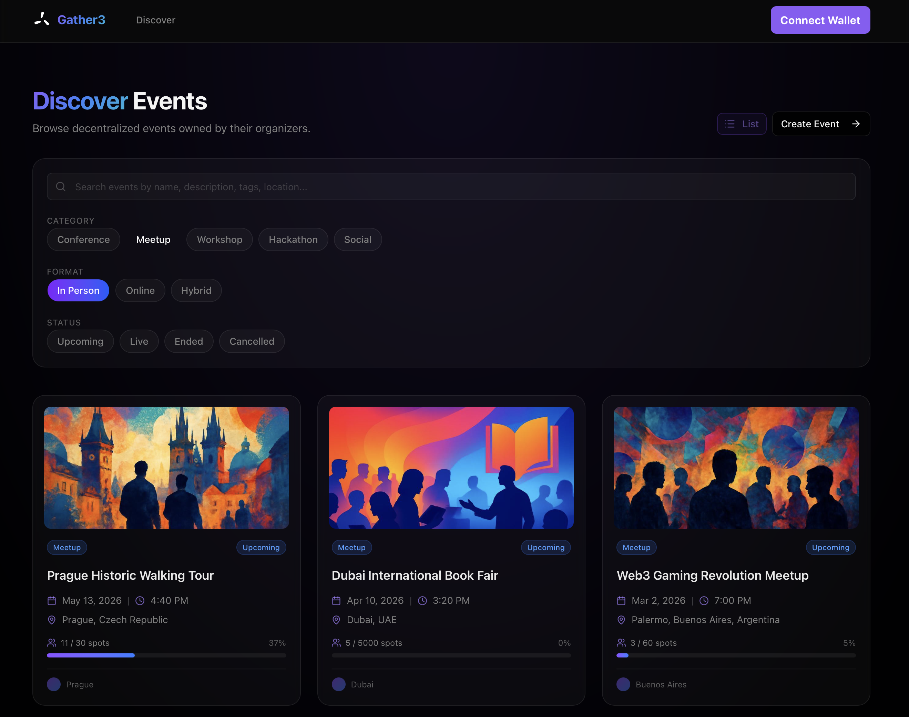
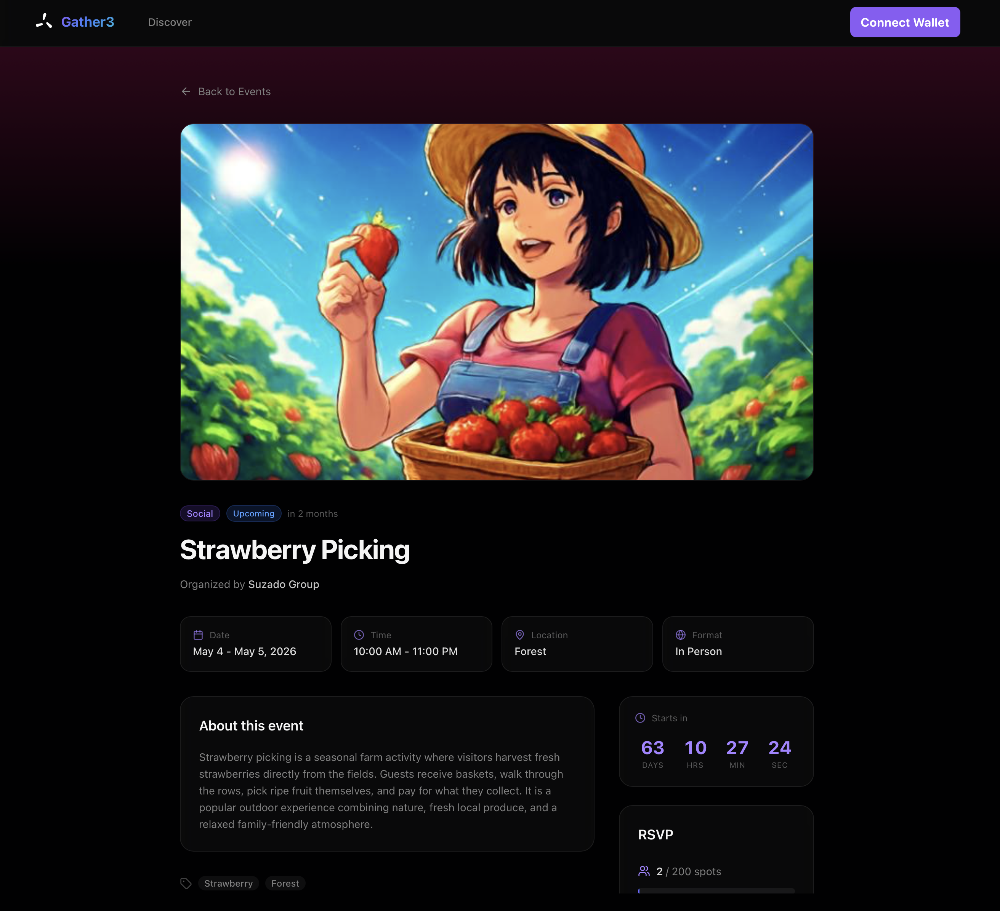
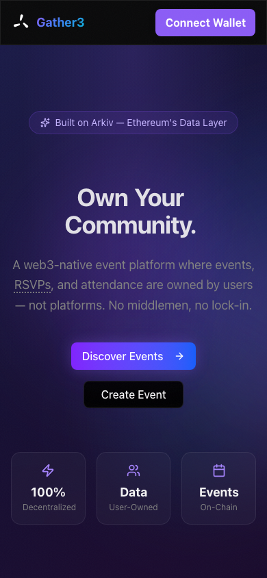
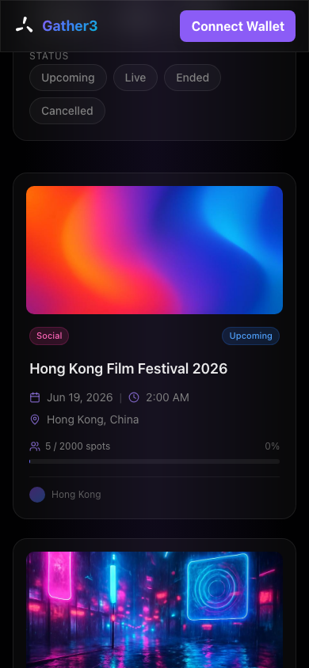

# Gather3 — Own Your Events

A web3-native event platform where events, RSVPs, and attendance are **owned by users, not platforms**. Built on [Arkiv](https://arkiv.network/) for the Arkiv Web3 Database Builders Challenge.

## What is Gather3?

Gather3 is a decentralized alternative to Luma/Eventbrite where:

- **Organizers** create and manage events with full on-chain ownership
- **Attendees** RSVP with their own wallet — they own their RSVP, not the platform
- **Ownership transfers** allow events to be handed off between organizers
- **All data** lives on Arkiv's decentralized storage with automatic expiration

## Screenshots

### Landing Page
<p align="center">
  
</p>

### Discover Events
<p align="center">
  
</p>

### Event Detail
<p align="center">
  
</p>

### Responsive Design
<p align="center">
  
  &nbsp;&nbsp;&nbsp;
  
</p>

## Arkiv Integration

Gather3 demonstrates deep Arkiv SDK integration across every feature:

### 4 Entity Types

| Entity | Owner | Expiration | Purpose |
|--------|-------|-----------|---------|
| **Organizer** | Organizer wallet | 1 year | Identity profile for event hosts |
| **Event** | Organizer wallet | endDate + 30 days | Event details, discoverable via queries |
| **RSVP** | Attendee wallet | endDate + 7 days | Cross-wallet ownership (attendee ≠ organizer) |
| **Attendance** | Organizer wallet | 6 months | Proof of attendance / check-in record |

### SDK Features Used

- **`createEntity`** — Create organizers, events, RSVPs, attendance records
- **`updateEntity`** — Edit events, update organizer profiles, change event status (upcoming → live → ended)
- **`deleteEntity`** — Cancel RSVPs, delete events
- **`changeOwnership`** — Transfer event ownership to another wallet
- **`subscribeEntityEvents`** — Real-time RSVP feed with live notifications
- **Query Builder** — `eq`, `gt`, `lt`, `desc`, `ownedBy`, `count`, pagination for browsing/filtering events

### 4 Expiration Levels

Each entity type uses a different, business-justified expiration:
1. **Organizer**: 1 year (long-lived identity, renewable)
2. **Event**: endDate + 30 days (preserved for reference after event)
3. **RSVP**: endDate + 7 days (short grace period after event)
4. **Attendance**: 6 months (proof of attendance, medium retention)

### Cross-Wallet Ownership

The RSVP entity demonstrates cross-wallet ownership — the **attendee's wallet** owns the RSVP entity, while the **organizer's wallet** owns the event. This means attendees truly own their RSVPs and can cancel them independently.

## Features

### For Attendees
- Browse and filter events by category, format, status, and city
- RSVP to events with your wallet (you own your RSVP!)
- View your RSVPs in the dashboard
- See real-time RSVP activity via live feed

### For Organizers
- Create an organizer profile
- Create events with a multi-step form (basics → date/location → settings → preview)
- Manage event lifecycle: upcoming → live → ended / cancelled
- Transfer event ownership to another wallet
- View attendee list and RSVP count

### UI/UX
- Dark theme with glass-morphism design
- Framer Motion animations throughout
- Responsive layout (mobile-first)
- Loading skeletons, error boundaries, 404 page
- RainbowKit wallet connection with clean UX

## Tech Stack

| Layer | Technology |
|-------|-----------|
| Framework | Next.js 15 (App Router) |
| Styling | Tailwind CSS + shadcn/ui |
| Animations | Framer Motion |
| Wallet | RainbowKit + wagmi v2 |
| Data | Arkiv SDK (@arkiv-network/sdk) |
| Forms | React Hook Form + Zod |
| Notifications | Sonner |
| Icons | Lucide React |

## Getting Started

### Prerequisites

- Node.js 18+
- A wallet (MetaMask, Rainbow, etc.)
- ETH on Arkiv Mendoza testnet (get from [faucet](https://mendoza.hoodi.arkiv.network/faucet/))

### Setup

```bash
# Clone the repo
git clone <repo-url>
cd gather3

# Install dependencies
npm install

# Create .env.local
cp .env.local.example .env.local
# Add your WalletConnect Project ID

# Run development server
npm run dev
```

Open [http://localhost:3000](http://localhost:3000) in your browser.

### Environment Variables

```env
NEXT_PUBLIC_WALLETCONNECT_PROJECT_ID=your_project_id
NEXT_PUBLIC_ARKIV_CHAIN=mendoza
```

Get a WalletConnect Project ID at [cloud.walletconnect.com](https://cloud.walletconnect.com/).

## Project Structure

```
src/
├── app/                    # Next.js App Router pages
│   ├── page.tsx           # Landing page
│   ├── events/            # Browse, detail, create
│   ├── organizer/         # Profile, setup
│   └── dashboard/         # My events, my RSVPs
├── components/
│   ├── ui/                # shadcn/ui components
│   ├── events/            # EventCard, EventForm, EventGrid, etc.
│   ├── rsvp/              # RsvpButton, RsvpCounter, LiveRsvpFeed
│   ├── organizer/         # OrganizerCard, OrganizerForm
│   ├── common/            # AnimatedCounter, EmptyState, LoadingSkeleton
│   └── layout/            # Header, Footer, PageTransition
├── hooks/                 # React hooks for Arkiv data
├── lib/
│   ├── arkiv/             # Arkiv SDK integration layer
│   │   ├── client.ts      # Public + wallet client
│   │   ├── events.ts      # Event CRUD + queries
│   │   ├── rsvp.ts        # RSVP CRUD
│   │   ├── organizer.ts   # Organizer CRUD
│   │   ├── attendance.ts  # Attendance CRUD
│   │   ├── subscriptions.ts # Real-time events
│   │   └── types.ts       # TypeScript interfaces
│   ├── wallet/            # wagmi + Mendoza chain config
│   └── utils/             # Dates, constants, avatars
└── providers/             # Web3 + Arkiv providers
```

## Deployment

Deploy to Vercel:

```bash
npm run build
vercel deploy
```

Set environment variables in Vercel dashboard.

## Entity Relationship Diagram

```
Organizer ──1:N──> Event     (event.organizerKey = organizer.entityKey)
Event     ──1:N──> RSVP      (rsvp.eventKey = event.entityKey)
Event     ──1:N──> Attendance (attendance.eventKey = event.entityKey)
```

## License

MIT

---

Built for the [Arkiv Web3 Database Builders Challenge](https://arkiv.network/) hackathon.
